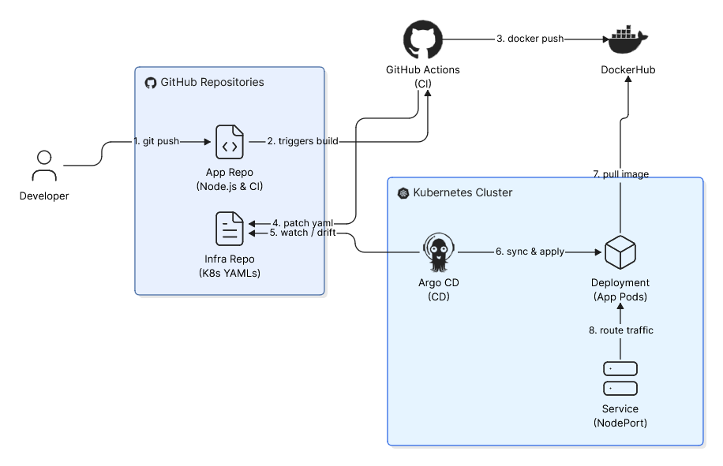

#  GitOps CI/CD Pipeline (App Repository)

This is the **Application Repository** of a two-part GitOps pipeline. It contains the source code for a Node.js web application and the Continuous Integration (CI) configuration.

> 🔗 **Infrastructure Repository:** The Kubernetes manifests for this application are stored separately in the [Gitops-project-infra](https://github.com/anka-cy/Gitops-project-infra) repository.

---

##  How the Pipeline Works

This project uses a **Two-Repo GitOps Architecture** to cleanly separate application code from infrastructure configuration.

1. **You Push Code:** Changes to the `main` branch trigger GitHub Actions.
2. **Build & Push:** The pipeline builds a new Docker image, tags it with the Git commit SHA, and pushes it to DockerHub.
3. **Update Infrastructure:** The pipeline then connects to the [Infrastructure Repository](https://github.com/anka-cy/Gitops-project-infra), updates `deployment.yaml` with the new image tag, and commits the change.
4. **Deploy:** ArgoCD (running in the Kubernetes cluster) detects the updated manifest in the infra repo and automatically deploys the new image.

